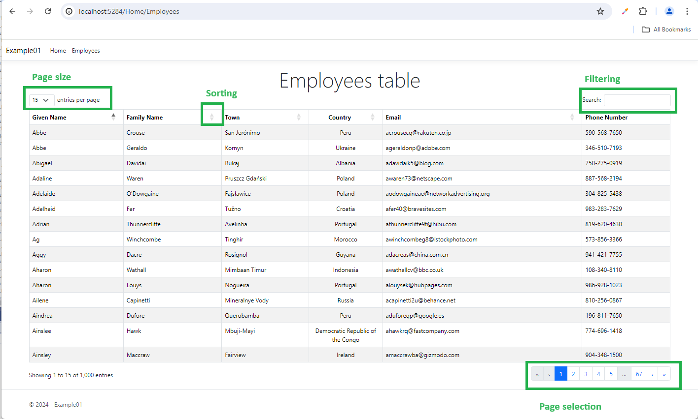
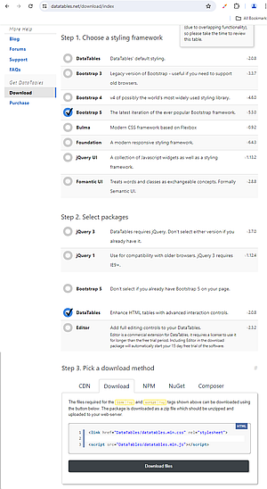
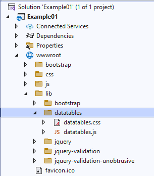

# ASP.NET8 using DataTables.net

A practical guide to using jQuery DataTables.net component in Asp.Net 8 MVC application.

***Abstract:  A practical guide to building an Asp.Net 8 MVC application that uses jQuery component DataTables.net. The article focuses on integrating different technologies (ASP.Net8, MVC, C#, Bootstrap 5, jQuery DataTables.net) into a professional-level application.*** 

## 1 ASP.NET8 using jQuery DataTables.net
I was searching for a freeware table component that would fit into my developing environment for my new project, which is ASP.NET8, C#, MVC, Bootstrap 5, EF. In a number of places, I saw mention of the jQuery DataTables.net component [1]. After shortly looking into different articles, I decided to create several ***prototype (proof-of-concept) applications*** to evaluate it for usage in my professional projects. These articles are the result of that evaluation. 

### 1.1 Articles in this series
Articles in this series are:  

**- ASP.NET8 using DataTables.net – Part1 – Foundation**   
https://www.codeproject.com/Articles/5385033/ASP-NET-8-Using-DataTables-net-Part1-Foundation

**- ASP.NET8 using DataTables.net – Part2 – Action buttons**   
https://www.codeproject.com/Articles/5385098/ASP-NET8-using-DataTables-net-Part2-Action-buttons

**- ASP.NET8 using DataTables.net – Part3 – State saving**   
https://www.codeproject.com/Articles/5385308/ASP-NET8-using-DataTables-net-Part3-State-saving

**- ASP.NET8 using DataTables.net – Part4 – Multilingual**   
https://www.codeproject.com/Articles/5385407/ASP-NET8-using-DataTables-net-Part4-Multilingual

**- ASP.NET8 using DataTables.net – Part5 – Passing additional parameters in AJAX**   
https://www.codeproject.com/Articles/5385575/ASP-NET8-using-DataTables-net-Part5-Passing-additi

**- ASP.NET8 using DataTables.net – Part6 – Returning additional parameters in AJAX**   
https://www.codeproject.com/Articles/5385692/ASP-NET8-using-DataTables-net-Part6-Returning-addi

**- ASP.NET8 using DataTables.net – Part7 – Buttons regular**   
https://www.codeproject.com/Articles/5385828/ASP-NET8-using-DataTables-net-Part7-Buttons-regula

**- ASP.NET8 using DataTables.net – Part8 – Select rows**   
https://www.codeproject.com/Articles/5386103/ASP-NET8-using-DataTables-net-Part8-Select-rows

**- ASP.NET8 using DataTables.net – Part9 – Advanced Filters**   
https://www.codeproject.com/Articles/5386263/ASP-NET8-using-DataTables-net-Part9-Advanced-Filte

## 2 Final result
Let us present the result of this article prototyping in **ASP.NET8, C#, MVC, Bootstrap 5** environment. Here is what you get:



You get a nice-looking table that feeds its data from background AJAX calls. The table itself, which you see in the picture is a jQuery component, and you write a back-end processing in C#. Any interaction with any of the **green areas** in this picture triggers a new AJAX call to the ASP.NET server with the new parameters which returns a new set of data.   

The benefit is that you do not need to write all the HTML/JavaScript to create the table, that is provided to you by the DataTables.net component. Of course, you need to learn the component API, and you are a bit limited by the UI options that the component is providing you. 

### 2.1 Positive impressions, but with reserve
My impressions are generally positive and I am going to use DataTables.net component in my projects. The logic is, that I need such a component to preset my tables, and if not using this one, I would need to develop my own version with similar functionality to present my tables.   

However, not everything is ideal. First of all, I already hit a bug in DataTables.net, which I reported and I depend on the Open Source community to resolve it. Next, not all is freeware, the Editor plug-in is commercial and is like $119 for a single license/year.    

The problem is for C# usage that DataTables.AspNet.Core library ([2],[3]) is no longer maintained since 2022. That is Open Source library I am using on ASP.NET/C# side for back-end processing. There are some bugs, and you are on your own to work around them. 

## 3 What is DataTables.net
DataTables.net is jQuery UI library and is well described on site [1], so I will not repeat all that here. Just to mention that it works in 2 modes:
1.	Client-side processing
2.	Server-side processing   

In mode 1) all table data (let's say 1000 rows) is loaded by the component into the browser and all filtering and sorting are done on the client side in the browser using JavaScript. From a professional usage point of view, that is a kind of naïve mode of work.    

In mode 2), the component makes AJAX calls to load only data that is going to be present (let's say 15 rows) and after each user interaction with the component, a new AJAX call is made to get the new data. In this article, we are interested only in this mode of work, which is the only one suitable for professional usage. 

### 3.1 How to get DataTables.net
Site [1] describes several ways to get the component, including CDN and NuGet packages. Not all worked well enough for me, so I found the best for me was to download it directly from the site and deploy it directly in the project:

   


``` js
<!-- _LoadingDatatablesJsAndCss.cshtml -->
<link rel="stylesheet" href="~/lib/datatables/datatables.min.css" asp-append-version="true" />
<script src="~/lib/datatables/datatables.min.js" defer asp-append-version="true"></script>
``` 

### 3.2 Literature
When dealing with the Open Source, it is necessary to collect all the literature available. I made a list of references, and here is an outline:   

•	**DataTables.net** component is at [1]. There is a nice manual describing API and all the options there    
•	**DataTables.AspNet.Core** library is described at [2], [3]. That is C#/.NET library for ASP.NET back-end processing. There are some examples of how to use it on the GitHub site.     
•	**Various articles and examples** are from [4]-[11]. If you find this tutorial too difficult, you might find some other article there easier to start with.   
•	**System.Linq.Dynamic.Core** library is described at [12]-[14]. It is a useful library for C# back-end processing    

## 4 Integration tutorial
The focus of this tutorial is the integration of different components in **ASP.NET8, C#, MVC, Bootstrap 5, JavaScript, jQuery** environment. I will not be talking much about individual components, they have been described elsewhere. I do not plan to repeat it all here.
### 4.1 Tutorial for Professionals
I will not pretend that this is an easy topic. This is a tutorial for experienced professionals. I will just point into the direction I am going and additional literature, and that is it. It is a waste of time and focus to detail all here. I assume knowledge of AJAX, Linq, JavaScript, MVC, ASP.NET etc. 


## 5 References

[1] https://datatables.net/    
[2] https://www.nuget.org/packages/DataTables.AspNet.Core/    
DataTables.AspNet.Core   
[3] https://github.com/ALMMa/datatables.aspnet    
[4] https://www.c-sharpcorner.com/article/using-datatables-grid-with-asp-net-mvc/    
Using DataTables Grid With ASP.NET MVC (MVC5)   
[5] https://www.c-sharpcorner.com/article/display-loading-or-processing-message-inside-datatable/    
Display Loading or Processing Message Inside DataTable   
[6] https://www.c-sharpcorner.com/article/create-datatable-in-jquery/    
Create a datatable in JQuery (pure jQuery)   
[7] https://www.c-sharpcorner.com/article/server-side-rendering-of-datatables-js-in-asp-net-core/       
Server Side Rendering Of DataTables JS In ASP.NET Core (2024)   
[8] https://www.c-sharpcorner.com/article/effortless-pagination-with-jquery-datatables-and-bootstrap/    
Effortless Pagination with jQuery DataTables and Bootstrap (very basic)   
[9] https://www.c-sharpcorner.com/article/asp-net-mvc-jquery-server-side-datatable-example/    
ASP.NET MVC jQuery Server Side Datatable Example   
[10] https://www.c-sharpcorner.com/article/pagination-in-mvc-with-jquery-datatable/    
Pagination In MVC With Jquery DataTable   
[11] https://codewithmukesh.com/blog/jquery-datatable-in-aspnet-core/#google_vignette    
JQuery Datatable in ASP.NET Core – Server-Side Processing   
[12] https://www.nuget.org/packages/System.Linq.Dynamic.Core    
System.Linq.Dynamic.Core   
[13] https://github.com/zzzprojects/System.Linq.Dynamic.Core    
zzzprojects/ System.Linq.Dynamic.Core   
[14] https://dynamic-linq.net/    
A FREE & Open Source LINQ Dynamic Query Library   


